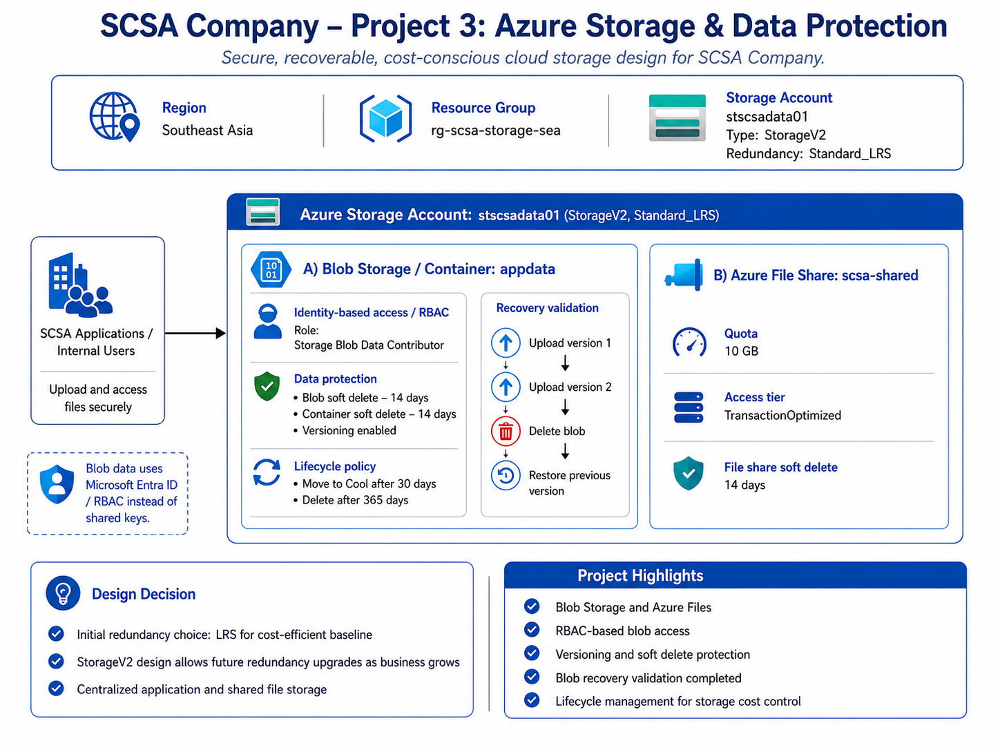

# SCSA Company – Project 3: Azure Storage and Data Protection

## Project Overview

This project demonstrates the design and implementation of a secure Azure Storage environment for SCSA Company.

The solution provides centralized object storage and shared file storage while implementing data protection, identity-based access control, recovery capabilities, lifecycle management, and cost-conscious storage design.

The environment uses Azure Blob Storage and Azure Files within a General Purpose v2 storage account.

## Business Scenario

SCSA Company requires centralized cloud storage for application data, internal files, and future workload integration.

The storage platform must:

- Provide object storage for application files and static assets
- Provide shared file storage for internal company data
- Protect against accidental deletion and overwrite
- Support version recovery
- Use Microsoft Entra-based authorization for Blob data access
- Automatically manage long-term storage cost
- Remain scalable as business requirements grow

## Architecture Diagram

## Azure Region

- Southeast Asia

## Resource Group

- `rg-scsa-storage-sea`

## Storage Account

- Name: `stscsadata01`
- Type: `StorageV2`
- Performance tier: Standard
- Redundancy: `Standard_LRS`
- Region: Southeast Asia

## Redundancy Design

Locally Redundant Storage (LRS) was selected for the initial SCSA storage environment.

LRS provides multiple copies of the data within the primary Azure region while maintaining a cost-efficient baseline for the current workload.

The storage account uses the StorageV2 account type so the redundancy strategy can be reevaluated as SCSA Company's availability and disaster recovery requirements increase.

Potential future options include:

- Zone-Redundant Storage (ZRS)
- Geo-Redundant Storage (GRS)
- Geo-Zone-Redundant Storage (GZRS)

The initial LRS design therefore represents the current business requirement rather than a permanent architectural limitation.

## Blob Storage

### Container

- Name: `appdata`
- Purpose: application files and static assets
- Public access: disabled

The Blob container is designed for application data that does not require anonymous public access.

## Azure Files

### File Share

- Name: `scsa-shared`
- Quota: 10 GB
- Access tier: TransactionOptimized

The file share provides centralized shared storage for internal SCSA Company files.

## Identity and Access Management

Blob data operations were configured using Microsoft Entra authentication rather than storage account keys.

The signed-in administrator was assigned:

`Storage Blob Data Contributor`

This role provides the required Blob data-plane permissions to:

- Read blob data
- Upload blob data
- Modify blob data
- Delete blob data

The administrator object ID is intentionally not stored in the repository.

## Blob Data Protection

The Blob service was configured with multiple protection mechanisms.

### Blob Soft Delete

- Enabled
- Retention period: 14 days

Deleted blobs can remain recoverable during the configured retention period.

### Container Soft Delete

- Enabled
- Retention period: 14 days

This protects against accidental deletion of an entire Blob container.

### Blob Versioning

- Enabled

Blob versioning automatically preserves previous versions when blob data changes.

## Azure Files Data Protection

File share soft delete was enabled with:

- Retention period: 14 days

This protects the Azure File Share against accidental share deletion during the retention period.

## Versioning and Recovery Validation

A test blob named:

`scsa-appdata.txt`

was used to validate versioning and recovery behavior.

### Test Sequence

1. Version 1 of the file was created and uploaded.
2. The local file was modified.
3. Version 2 was uploaded using the same Blob name.
4. Azure preserved both versions.
5. The current Blob was deleted.
6. Historical versions remained available.
7. The most recent previous version was restored.
8. Azure created a new current version of the Blob.

This validated that previous application data could be recovered after accidental deletion or overwrite.

## Lifecycle Management

A Blob lifecycle management policy was configured:

`scsa-appdata-lifecycle`

### Policy

| Action | Condition |
|---|---|
| Move Blob to Cool tier | 30 days after modification |
| Delete Blob | 365 days after modification |

The policy applies to block blobs under:

`appdata/`

This allows SCSA Company to automatically reduce storage cost as data becomes less frequently accessed.

## Security Design

The storage solution includes:

- Private Blob container
- Microsoft Entra-based authentication
- Azure RBAC for Blob data access
- No hard-coded account keys in deployment scripts
- Blob soft delete
- Container soft delete
- Blob versioning
- Azure Files soft delete

These controls provide both access protection and recoverability.

## Cost Management

Cost management was included as part of the storage architecture.

The environment uses:

- Standard storage
- LRS redundancy
- Small 10 GB Azure File Share quota
- Minimal test data
- Automated Blob lifecycle management
- Cool-tier transition after 30 days
- Automatic deletion after 365 days

Unlike the VM deployed in Project 2, the storage environment does not need to be deallocated when idle.

Storage cost is primarily based on stored data, transactions, redundancy, and access tier.

Because the project contains only minimal test data, the environment can remain deployed at low cost while still serving as part of the SCSA Azure architecture.

## Troubleshooting

### Storage Data-Plane Authorization

During the first Blob upload attempt, the signed-in Azure user received a permissions error.

The account had sufficient permissions to create and manage the Azure Storage resource but did not initially have Blob data-plane permissions.

The issue was resolved by assigning:

`Storage Blob Data Contributor`

This demonstrates the distinction between:

- Azure resource management permissions
- Storage data-plane permissions

### Blob Deletion with Versioning

When the current Blob was deleted, a standard deleted-Blob listing did not display the expected result because Blob versioning was enabled.

The historical Blob versions remained available and were used to restore the deleted Blob.

This demonstrated how Blob versioning affects recovery behavior.

## Implementation

The environment was deployed and configured using Azure CLI.

### Deployment Scripts

- [01-resource-group.sh](./scripts/01-resource-group.sh) – Creates the storage resource group.
- [02-storage-account.sh](./scripts/02-storage-account.sh) – Creates the StorageV2 account using Standard LRS.
- [03-storage-services.sh](./scripts/03-storage-services.sh) – Creates the Blob container and Azure File Share.
- [04-data-protection.sh](./scripts/04-data-protection.sh) – Enables Blob soft delete, container soft delete, versioning, and Azure Files soft delete.
- [05-rbac.sh](./scripts/05-rbac.sh) – Assigns Storage Blob Data Contributor using the signed-in user's Entra object ID.
- [06-blob-versioning-recovery.sh](./scripts/06-blob-versioning-recovery.sh) – Demonstrates Blob version creation and validation.
- [07-lifecycle-policy.sh](./scripts/07-lifecycle-policy.sh) – Creates and applies the Blob lifecycle management policy.

## Implementation Evidence

Detailed implementation and validation screenshots are available in the [`screenshots`](./screenshots/) directory.

Evidence includes:

- Storage resource group
- Storage account deployment
- Blob container
- Azure File Share
- Blob data protection
- Container soft delete
- File share soft delete
- Blob RBAC assignment
- Blob versioning
- Blob deletion and historical versions
- Blob recovery
- Lifecycle management
- Final storage configuration validation

## Skills Demonstrated

- Azure Storage Accounts
- Azure Blob Storage
- Azure Files
- Microsoft Entra authentication
- Azure RBAC
- Storage data-plane permissions
- Blob versioning
- Blob soft delete
- Container soft delete
- Azure Files soft delete
- Blob recovery
- Lifecycle management
- Storage access tiers
- Azure CLI
- Azure cost management
- Azure troubleshooting
- Infrastructure documentation

## Project Status

**Completed**

The SCSA Company storage environment was successfully deployed, secured, protected, tested, and validated.

This project builds on the Azure networking and compute infrastructure established in Projects 1 and 2 and introduces the centralized storage and data protection layer required by future SCSA workloads.
